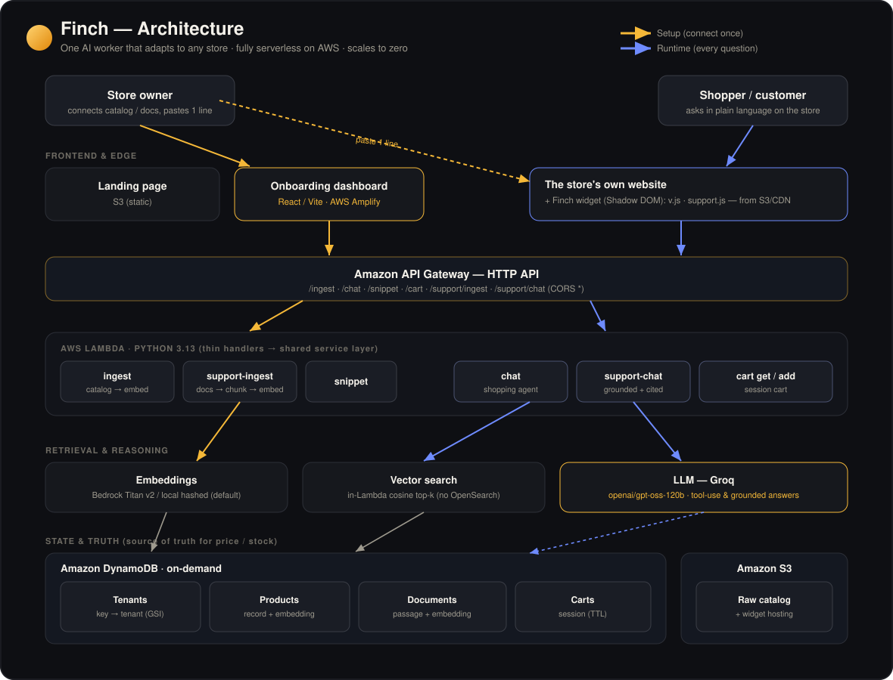
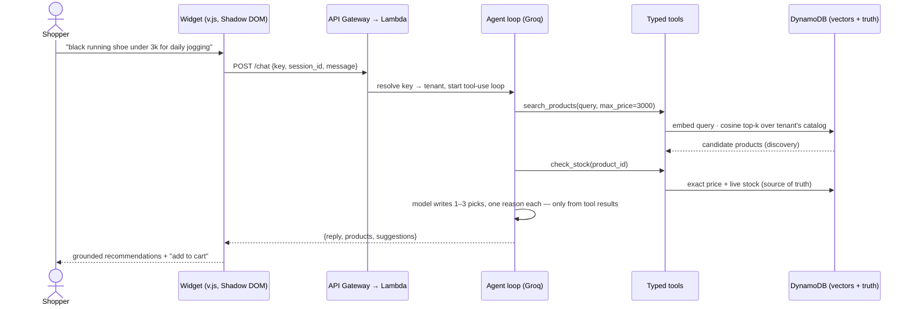

<p align="center">
  
</p>

<h1 align="center">Finch</h1>

<p align="center">
  <b>The easiest way for a small business to put an AI agent on its website.</b>
</p>

<p align="center">
  Building, testing, deploying and managing AI agents is hard. Finch does it for you —<br />
  turn on a <b>ready-made agent</b> or <b>build your own with no code</b>, then paste one <code>&lt;script&gt;</code> line into your existing site.<br />
  <b>No developers. No $1000+ bill. No weeks of work.</b>
</p>

<p align="center">
  
  
  
  
  
  
</p>

<p align="center">
  <a href="https://finch-widget-938358604976.s3.ap-south-1.amazonaws.com/landing/index.html"><b>Landing</b></a> ·
  <a href="https://main.d3hnwgsalj9ele.amplifyapp.com"><b>Live dashboard</b></a> ·
  <a href="DEPLOYMENT.md"><b>All live links &amp; AWS resources</b></a>
</p>

<p align="center">
  
  
  
  
  
</p>

<p align="center">
  <i>Pick or build an agent · connect your data · copy one snippet · manage it from a dashboard.</i>
</p>

> ⚠️ **Every Finch agent answers only from the business's own data.** It never invents a product, price, stock level, or policy — if it isn't in the data, the agent says it doesn't know.

---

## The Problem

**For a small or medium business, putting an AI agent on your website is hard — not the idea, the doing.** The moment you go past "wouldn't it be nice," you hit a wall that's built for teams with engineers and budget:

- **Building an agent is an engineering project.** Prompts, tool-calling, retrieval over your own data, grounding so it doesn't lie — that's specialist work most SMBs don't have in-house.
- **Testing and deploying it is worse.** Where does it run? How do you host it, scale it, keep it from costing money while idle, and wire it into the site you already have?
- **Managing it never ends.** Updating what the agent knows, watching what customers ask, changing its behaviour — an ongoing job, not a one-time build.
- **So the "fix" is a four-figure project.** Developers, weeks of integration, an agency retainer. Most SMBs can't justify it — so they ship **no agent at all**, and keep losing the customers an agent would have helped.

**Finch removes the whole wall.** It's a platform where an SMB can **turn on a ready-made agent or build one with no code**, integrate it with **one `<script>` line** into their existing site, and manage it from a dashboard — no developers, no $1000+, no weeks.

### Before → After

The path to a working agent on your site — the hard way, versus Finch:

| Getting an AI agent live today | With Finch |
|---|---|
| **Build** — prompts, tool-calling, retrieval, grounding — from scratch | **Turn on a ready-made agent** or build one in a **no-code** flow |
| **Test** — stand up infra just to try it | Connect your data and it's working immediately |
| **Deploy** — host, scale, secure, keep costs down | Runs on Finch's **serverless AWS** back end — **$0 when idle** |
| **Integrate** — a developer wires it into your site | Paste **one `<script>` tag** — live in minutes |
| **Manage** — a standing engineering cost | Update data & watch questions from **one dashboard** |
| A generic bot that invents prices and policies | **Grounded by design** — the agent only ever sees your real data |
| A four-figure agency bill + weeks of waiting | **No devs · no $1000+ · no weeks** |

**Who it's for.** Small-to-mid-size businesses — starting with online stores — that want AI agents on their site but can't fund a custom build or run one afterwards. Finch is the "pick it, or build it, then paste one line" option for exactly that gap.

## What Finch Is

Finch is an **agent platform for SMBs**, not a single chatbot. Three parts:

1. **🧩 Ready-made agents** — prebuilt, proven agents a business can switch on and point at their own data. No agent design required.
2. **🛠️ A no-code agent builder** — for teams that want their own: describe the agent, connect data, deploy — all in the dashboard, no engineering.
3. **🔌 One-line integration + management** — every agent ships as a single `<script>` tag that drops into an existing website, and a dashboard to feed it data (Business Brain), watch real questions (Monitor), and change its behaviour — no redeploys, no developer.

Under the hood, every agent — ready-made or self-built — runs on the **same serverless pipeline, embed model and storage layer**, so an SMB never touches infrastructure.

### The prebuilt agents

Two agents ship today. The **Shopping agent was the first one we built** — the proof that the platform works end-to-end — and the **Support agent** followed on the same rails:

| Agent | What it does | Grounded in | How it runs | Ships as |
|---|---|---|---|---|
| 🛒 **Shopping agent** *(the first we built)* | Understands vague needs, recommends real products with a one-line reason each, confirms live price/stock, adds to cart | The business's **product catalog** | An LLM **tool-use loop** (search → check stock → add to cart) | `v.js` — AI search on the site's *own* search bar |
| 🎧 **Support agent** | Answers customer questions in plain language and **cites the document** each answer came from; says "I don't know" instead of guessing | The business's **PDFs / policies / FAQs** | A **single grounded completion** over retrieved passages | `support.js` — a floating chat bubble |

Because they share one substrate, **adding the next prebuilt agent is mostly a new prompt + a new widget** — which is exactly what the no-code builder automates for the business.

### The one loop — for any agent

```
pick or build an agent  →  connect data (CSV · store URL · PDF · docs)  →  auto-chunk & embed into DynamoDB
        →  copy one <script>  →  paste on your site  →  visitor asks in natural language
        →  the agent retrieves your real data  →  grounded (and, for support, cited) answer  →  manage it from the dashboard
```

**Not slideware.** The Support agent is **live end-to-end on AWS** today — upload docs, get grounded, cited answers — with both widgets and the onboarding dashboard deployed. Live links: [DEPLOYMENT.md](DEPLOYMENT.md).

---

# System Architecture

The core idea, borrowed from good agent design and enforced here in code: **separate reasoning from truth.** The LLM decides *what* to look for from natural language; **typed tools and structured records decide what's actually true.** The model never sees the raw catalog or documents — only the results the tools hand back — so it physically cannot quote a hallucinated price or invent a policy.



**Two paths through one backend:**

- **Setup path.** The owner connects a catalog or uploads docs → `/ingest` or `/support/ingest` → every product / passage is embedded and written to DynamoDB (the embedding lives *on the item*) → the owner pastes one `<script>` line, keyed to their tenant.
- **Runtime path.** A visitor asks in the widget → `/chat` or `/support/chat` → the Lambda embeds the query, runs an **in-Lambda cosine search** over just that tenant's vectors, and hands the top matches to the LLM, which writes a grounded (and, for support, cited) answer.

### Request lifecycle — one shopping turn



**Why this design:**

- **Discovery vs. truth are separate on purpose.** Vector search is great at *finding* candidates from a fuzzy need, but it's the wrong place to read a price from. So `search_products` finds; `check_stock` reads the exact price and live stock from the structured DynamoDB record. The agent is instructed to confirm with `check_stock` before it states a number.
- **The model only ever sees tool output.** It's handed retrieval results, never the catalog. Grounding isn't a polite request in the prompt — it's a property of what data ever reaches the model.
- **Vectors live in DynamoDB, ranked in-Lambda.** A brute-force cosine over a tenant's items runs in the Lambda that's already warm. This deliberately avoids OpenSearch Serverless, whose minimum footprint is an always-on hourly charge — the whole stack instead **scales to zero** and costs ~$0 idle. Fine for SMB-scale catalogs; the swap-in path to a real vector DB is a one-file change (`lib/vectors.py`).
- **Why not a mega-prompt with the catalog pasted in?** It hallucinates prices, blows the context window on a real catalog, and can't be trusted on stock. Tools + structured truth is what makes the answer safe to show a paying customer.

## The provider abstraction — the design that makes Finch portable

Every expensive or account-gated dependency in Finch sits behind a single environment variable, so the *same* code runs from a laptop with zero AWS all the way to the live serverless stack. This is what let the whole thing be built and tested while AWS credits and Bedrock verification were still pending.

| Switch | Values | What flips | Why it exists |
|---|---|---|---|
| `FINCH_BACKEND` | `local` · `aws` | JSON-file store ↔ **DynamoDB** (via a one-file `store` facade) | Run and test the *entire* pipeline offline; ship the identical code to Lambda |
| `FINCH_EMBED` | `local` · `bedrock` | Deterministic hashed vector ↔ **Bedrock Titan v2** semantic vectors | Run the real AWS stack at **$0 embeddings** until you turn semantic search on |
| `FINCH_AGENT` | `off` · `on` | Templated / extractive reply ↔ **LLM answer** | The product degrades gracefully — it still works with no LLM at all |
| `FINCH_AGENT_PROVIDER` | `groq` · `bedrock` | **Groq** OpenAI-compatible API ↔ Bedrock Converse | Pick your LLM without touching agent code |

The killer property: **`store.py` re-exports either the local or the DynamoDB backend based on one flag**, and every layer above it (`service`, handlers, agents) imports from `store` only. Switching a laptop to the live cloud is *one env var*, no code edits.

## Why Groq

Finch runs its agents on **Groq's `openai/gpt-oss-120b`** (OpenAI-compatible chat + tool calling): fast, on a free tier, and with **no account-verification wall** — which matters for a hackathon-speed build. Because the provider is abstracted, Bedrock Converse is a drop-in alternative (`FINCH_AGENT_PROVIDER=bedrock`) if you'd rather keep everything inside AWS. Groq handles chat and tool-use only; embeddings stay on their own switch (`local` by default, Bedrock Titan when you flip it).

## Scaling to many stores

Finch is multi-tenant from the first line: every widget carries a publishable `embed_key`, resolved to a tenant through a DynamoDB **GSI**, and every product/document/cart row is partitioned by `tenant_id`. The runtime is already stateless and serverless:

```
S3 (widgets + landing, + CloudFront/custom domain later)   ← static, cached at the edge
        ▼
API Gateway (HTTP)  →  Lambda (python3.13, scales 0 → N automatically)
        ├─▶ DynamoDB (on-demand)  — Tenants (+embed_key GSI) · Products · Documents · Carts (TTL)
        ├─▶ S3                     — raw per-tenant catalog snapshots
        └─▶ Groq / Bedrock         — LLM reasoning (per-request, no idle cost)
```

There are **no servers to manage and nothing running when idle** — DynamoDB is pay-per-request, Lambda scales to zero, S3 is static. The one intentional simplification is brute-force vector ranking in Lambda; when a single tenant's catalog outgrows that, `lib/vectors.py` is the one seam to point at a dedicated vector store, with everything above it unchanged.

---

# The Prebuilt Agents

The two agents that ship today, in depth. Each does one job well, shares the ingestion/retrieval substrate described above, and stays grounded by construction — the same rails the no-code builder gives an SMB for their own agents.

## 🛒 Shopping agent — a tool-use salesperson

An LLM **function-calling loop** (`backend/src/agent/agent.py`, `MAX_TURNS = 6`). The model is given five typed tools and reasons by *calling* them — it never receives the catalog directly.

| Tool | Purpose |
|---|---|
| `search_products(query, max_price?, min_price?, category?)` | Vector-search the catalog for a fuzzy need (discovery) |
| `get_product(product_id)` | Full details for one item |
| `check_stock(product_id)` | **Exact price + live stock** — the source of truth |
| `add_to_cart(product_id, qty)` | Add an item to the shopper's session cart |
| `get_cart()` | The shopper's current cart |

Tools are **bound to one tenant + session** (`agent/tools.py`), so the model only reasons about `query` / `product_id` / `qty` and can never reach across tenants. The system prompt pins the behaviour: understand vague requests, ask at most one clarifying question, recommend 1–3 items with a one-line reason each, confirm price/stock before stating it, and **never invent products, prices, or stock.** If the loop ever hiccups, `service.chat_turn` silently falls back to retrieval + a templated reply — search never breaks because the LLM did.

**Ships as `v.js`:** instead of a corner chatbot, it enhances the store's **own search bar** — finds the host site's `<input>`, wraps it in an animated "AI" glow, and renders matching products in a dropdown beneath it. Fully isolated in a **Shadow DOM** so it can't clash with the host site's CSS.

## 🎧 Support agent — grounded, cited answers

Unlike the shopping loop, support is a **single grounded completion** (`backend/src/agent/support.py`). Retrieval happens in the service layer; the agent only turns *{question + retrieved passages}* into a written answer that uses **only** those passages and cites them inline as `[1]`, `[2]`.

- **Ingestion** (`lib/docs.py`): plain text / Markdown, pre-extracted PDF text (via pdf.js in the browser, or `pypdf` server-side), or a help-page URL → cleaned → chunked into ~800-char passages with 120-char overlap so a sentence split across a boundary is still recoverable. Each chunk is embedded and stored, one item per passage — the exact same discovery-vs-truth pattern as products.
- **Answering** (`service.answer_question`): embed the question → cosine top-k over the tenant's chunks → hand the passages to the LLM with a strict "answer only from these, cite inline, say you don't know otherwise" system prompt → return `{reply, sources, suggestions}` where `sources` are compact citation cards (doc name + snippet + score).
- **Graceful degradation:** with **no LLM key at all**, the support agent still works — it returns the single most-relevant passage, honestly attributed ("Here's what the docs say — from *Returns Policy*…"). With a key, that becomes a conversational answer with inline citations. The customer always gets a real, sourced answer.

**Ships as `support.js`:** a floating chat bubble, Shadow-DOM isolated, that opens a panel and answers from the store's own docs.

## The shared substrate

Both agents stand on the same four pieces, so adding a third agent later is mostly a new prompt + a new widget:

- **Embeddings** (`lib/embeddings.py`) — one `embed()` interface, two backends. Local is a deterministic 256-dim hashed bag-of-words vector (not semantic, but it makes the whole embed→store→search pipeline real and testable with zero AWS) with crude plural-stemming so *"hoodies"* matches *"hoodie"*; AWS is Bedrock Titan Text v2.
- **Vector search** (`lib/vectors.py`) — brute-force cosine top-k with optional `max_price` / `min_price` / `category` filters.
- **Storage facade** (`lib/store.py`) — re-exports the local JSON store or DynamoDB based on `FINCH_BACKEND`; every caller imports from here only.
- **Catalog ingestion** (`lib/catalog.py`) — CSV, Shopify `/products.json`, and schema.org **JSON-LD**, in that order of reliability. JS-rendered SPAs (e.g. Lovable) expose no feed, so Finch raises a clear "upload a CSV instead" error rather than guessing.

---

## Tech Stack

| Layer | Choice |
|---|---|
| **Agent brain** | **Groq** `openai/gpt-oss-120b` — LLM tool-use loop (shopping) + grounded completion (support); Bedrock Converse as a drop-in alternative |
| **Embeddings** | Deterministic local hashed vector (**$0**, default) *or* Bedrock **Titan Text v2** — behind one switch |
| **Vector store** | **DynamoDB** (embedding stored on the item) + **in-Lambda cosine top-k** — no OpenSearch, no idle cost |
| **API** | Amazon **API Gateway** (HTTP) + **AWS Lambda** (Python **3.13**, x86_64) — 7 functions |
| **State** | **DynamoDB** on-demand — Tenants (+`embed_key` GSI) · Products · Documents · Carts (TTL) |
| **Storage / CDN** | **S3** — raw per-tenant catalogs + public widget & landing hosting |
| **Onboarding UI** | **React + Vite** on **AWS Amplify Hosting** (auto-deploys on push to `main`) |
| **Widgets** | Vanilla JS, **Shadow DOM** — `v.js` (AI search) · `support.js` (chat bubble) |
| **Landing** | Single self-contained static `index.html` on S3 |
| **IaC** | **AWS SAM** (`infra/template.yaml`) — one stack, scales to zero |

## Project Structure

```
Finch/
├── backend/                         # Python — the serverless core (identical code local & on Lambda)
│   └── src/
│       ├── service.py               # core logic: ingest · search · cart · chat · support answer
│       ├── config.py                # every provider switch (BACKEND / EMBED / AGENT / PROVIDER)
│       ├── local_server.py          # FastAPI dev server — same contracts as the API Gateway routes
│       ├── agent/
│       │   ├── agent.py             # Shopping agent — LLM tool-use loop (Groq | Bedrock)
│       │   ├── support.py           # Support agent — grounded, cited completion
│       │   └── tools.py             # 5 typed tools, bound per tenant + session
│       ├── lib/
│       │   ├── embeddings.py        # embed() — local hashed  |  Bedrock Titan
│       │   ├── vectors.py           # in-Lambda brute-force cosine top-k + filters
│       │   ├── catalog.py           # CSV · Shopify products.json · schema.org JSON-LD
│       │   ├── docs.py              # doc → clean → chunk (support ingestion)
│       │   ├── store.py             # storage facade — local_store | dynamo (one flag)
│       │   ├── local_store.py  dynamo.py  objectstore.py  ids.py
│       └── handlers/                # thin Lambda entrypoints (ingest · chat · snippet · cart · support)
│   └── scripts/                     # smoke.py (stdlib pipeline test) · http_smoke.py (live API test)
│
├── onboarding/                      # React + Vite dashboard — build agents, upload data, get the snippet
│   └── src/
│       ├── App.jsx                  # shell: Home · Business Brain · Monitor
│       └── components/              # AgentBuilder · SupportAgentBuilder · ShoppingAgentSetup
│                                    # ConnectStep · IndexingStep · LiveStep · Monitor · Sidebar …
│
├── widget/                          # Embeddable widgets (Shadow DOM) + local demos
│   ├── v.js                         # Shopping — AI search on the host's own search bar
│   ├── support.js                   # Support — floating chat bubble
│   └── demo/                        # support.html · index.html — upload docs & chat locally
│
├── landing/index.html               # Static marketing page (single self-contained file)
├── infra/                           # AWS SAM template + runbooks (DEPLOY.md · AMPLIFY.md)
├── docs/                            # PRD (Finch-PRD.md) + architecture.svg
├── DEPLOYMENT.md                    # All live links + AWS resources
└── README.md
```

## Local Development

The backend runs **fully locally with zero AWS** — a JSON-file store and a deterministic local embedding stand in for DynamoDB + Bedrock. Switch to the real cloud with one env var.

**Prerequisites:** Python 3.11+, Node 18+. Blocks below are PowerShell (Windows); the bash equivalents are noted where they differ.

### 1. Backend

```powershell
cd backend
python -m venv .venv
.venv\Scripts\pip install -r requirements-dev.txt
$env:FINCH_BACKEND = "local"
.venv\Scripts\python -m uvicorn src.local_server:app --port 8000
```

```bash
# bash / macOS / Linux
cd backend && python -m venv .venv && ./.venv/bin/pip install -r requirements-dev.txt
FINCH_BACKEND=local ./.venv/bin/python -m uvicorn src.local_server:app --port 8000
```

Smoke-test the whole pipeline with no server (stdlib only): `python scripts/smoke.py`
Test the running HTTP API: `python scripts/http_smoke.py`

### 2. Onboarding dashboard

```powershell
cd onboarding
npm install
npm run dev        # http://localhost:5173
```

The Support flow calls the backend at `VITE_FINCH_API` (defaults to `http://127.0.0.1:8000`).

### 3. Widgets + landing (static)

```powershell
cd widget
python -m http.server 5600          # serves v.js, support.js and /demo/*

cd ..\landing
python -m http.server 5500          # the marketing page
```

Open `http://localhost:5600/demo/support.html` to upload docs and chat against them with the live support bubble.

## Configuration

All configuration is environment variables (see [`backend/src/config.py`](backend/src/config.py)):

| Variable | Default | Purpose |
|---|---|---|
| `FINCH_BACKEND` | `local` | `local` (JSON store) or `aws` (DynamoDB) |
| `FINCH_EMBED` | `local` | `local` (hashed) or `bedrock` (Titan v2 semantic) |
| `FINCH_AGENT` | `off` | `on` routes chat through the LLM; `off` uses a templated / extractive reply |
| `FINCH_AGENT_PROVIDER` | `groq` | `groq` or `bedrock` |
| `GROQ_API_KEY` | – | Groq key (`gsk_…`); the agent turns on automatically once set |
| `GROQ_MODEL` | `openai/gpt-oss-120b` | Groq model id |
| `TOP_K` / `TOP_K_DOCS` | `3` / `4` | Retrieval breadth for products / doc passages |

## Deployment

Fully serverless, scales to zero. Step-by-step runbooks: **[infra/DEPLOY.md](infra/DEPLOY.md)** (backend) and **[infra/AMPLIFY.md](infra/AMPLIFY.md)** (frontends); all live links and resources: **[DEPLOYMENT.md](DEPLOYMENT.md)**.

```bash
cd infra
sam build
sam deploy --guided        # stack: finch, region: ap-south-1
# to turn the LLM on, pass your Groq key (required each deploy or it resets to extractive mode):
#   --parameter-overrides GroqApiKey=gsk_...
```

Onboarding auto-deploys: push to `main` and Amplify rebuilds from `onboarding/.env.production`. Widgets and the landing page are static → `aws s3 cp` (see DEPLOYMENT.md).

## API Reference

Base: `https://gsq790ciza.execute-api.ap-south-1.amazonaws.com`

| Method | Path | Body | Purpose |
|---|---|---|---|
| POST | `/ingest` | `{business_name, source, payload}` | Embed + index a catalog → `{tenant_id, embed_key, product_count}` |
| POST | `/chat` | `{key, session_id, message}` | Shopping turn → `{reply, products, suggestions}` |
| GET | `/snippet/{tenant_id}` | – | The embed snippet for a tenant |
| GET | `/cart/{session_id}` | – | Current cart |
| POST | `/cart/{session_id}/add` | `{key, product_id, qty}` | Add to cart |
| POST | `/support/ingest` | `{business_name, docs:[{name,text}]}` | Chunk + embed docs → `{tenant_id, embed_key, doc_count, chunk_count}` |
| POST | `/support/chat` | `{key, session_id, message}` | Support turn → `{reply, sources, suggestions}` |

## Safety, Trust & Grounding

Finch is a **hackathon prototype**, but grounding is built into the architecture, not bolted on:

- **The model can't quote what it never sees.** Both agents receive only tool/retrieval results — never the raw catalog or documents — so a hallucinated price or invented policy has no path to the customer.
- **Discovery ≠ truth.** Prices and stock are read from the structured record via `check_stock`, not from the fuzzy vector match.
- **Honest "I don't know."** The support agent refuses to guess when the answer isn't in the retrieved passages, and points the customer to the team instead.
- **Graceful degradation.** No LLM key → the support agent still returns a real, sourced passage; a shopping-loop error → retrieval + a templated reply. The store is never left with a broken widget.
- **Multi-tenant isolation.** Tools are bound to one tenant + session; every row is partitioned by `tenant_id`; the widget key is publishable by design (CORS is open for the MVP and tightens to a `domain_allowlist` post-MVP).

Secrets are never committed — the Groq key is passed at deploy time via SAM parameter override (`NoEcho`), never stored in the repo.

## Status

- **Live now:** Support agent end-to-end on AWS (ingest → grounded, cited answers), both widgets, onboarding on Amplify, landing on S3.
- **Follow-ups:** wire the Shopping onboarding flow to the real `/ingest` (currently a front-end mock); custom domains via CloudFront; move landing to a second Amplify app once the account is verified; real semantic embeddings (`FINCH_EMBED=bedrock`) once Bedrock access is enabled.

---

<p align="center">
  
</p>

<p align="center">
  <i>Darwin's finches each adapted to fit their island — different beak, same bird.</i><br />
  Ready-made and self-built AI agents that adapt to fit any business — live in one line.
</p>

<p align="center">
  Built for the <b>First Commit — Bharat Builds Tour</b> hackathon (Ship It track).
</p>
