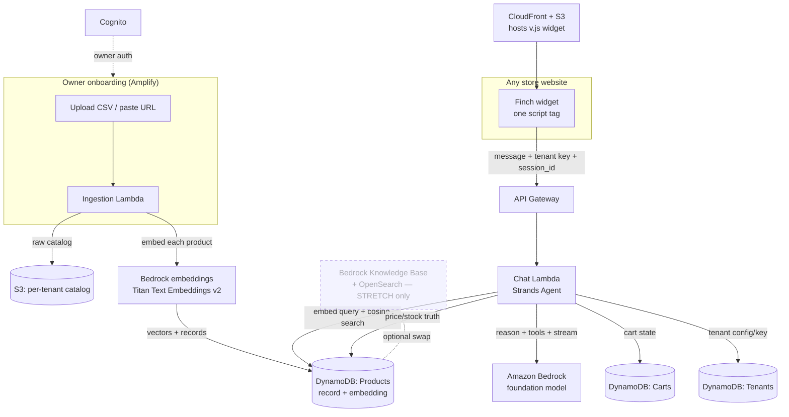

# Finch — Product Requirements Document

> **One line:** Finch is one AI worker that adapts to fit any business. Drop one line into your site and it already knows your store.

> **The name:** Darwin's finches each adapted to fit their island — different beak, same bird. Finch is one AI worker that adapts to fit any business.

| | |
|---|---|
| **Name** | **Finch** (locked) |
| **Hackathon** | First Commit — Bharat Builds Tour (WeMakeDevs × AWS), Sept 17–20 2026 |
| **Target track** | **Ship It** (deploy live on AWS + URL) — where the grand prize and the Amazon fast-track are decided. Best UI is a free secondary target via the widget + onboarding page. |
| **Team size** | 1–4 |
| **Deliverables** | Live URL · public GitHub repo · 3-min demo video · AWS Builder Center blog |

---

## 1. Problem

Small online stores lose sales at the exact moment a customer is ready to buy. Their site search is keyword-dumb ("running shoe" ≠ "shoe for daily jogging under 3k"), they have no staff to answer product questions, and they cannot afford to hire a developer to build AI onto their site.

The tools that exist don't fit them:

- **Platform-locked agents** (e.g. Shopify's) only work if you're already on that platform. Most Indian SMB stores aren't, or run a mix.
- **Generic chatbot builders** make the owner *build* the bot, wire integrations, and maintain it — weeks of work they don't have.
- **Enterprise conversational-commerce tools** are priced and scoped for large retailers.

**The gap:** there is no way for a non-technical store owner to get a real shopping agent that understands *their specific catalog* onto *their existing site* in minutes.

---

## 2. The core concept

The differentiator is **not** the chat. It's the **integration + instant catalog understanding** — one worker that reshapes itself to each store's catalog (the finch's beak), while staying the same underlying agent.

> Connect your catalog → copy one line → paste it on your site → the agent is live and already knows your products.

Everything in this PRD is subordinate to protecting that "it just works on any site" moment, because that is the concept the judges will remember and the thing no incumbent gives an off-platform SMB.

**One worker, not a workforce.** The "adapts to fit any business" promise is about *adaptation*, not *multiplication* — Finch is a single agent that fits itself to each store, which is exactly why §3 kills multi-agent / "AI workforce." Same bird, different beak.

**Two integration steps — different levels of "hands-off" (be precise about this):**
1. **Teaching the agent the catalog** — near-zero-touch. Paste a store URL and we crawl it, or upload a CSV. No dev work.
2. **Putting the agent on the site** — **one script snippet, always.** This is a deliberate, final decision, not a placeholder (see §11.1 for why every no-snippet alternative is worse for this product). Pasting one line into a site's header/embed settings is a 30-second settings action, not development — it fully honors "no developers, no rebuild."

---

## 3. Goals & non-goals

### Goals (what "done" means for the hackathon)
- G1 — A store owner can connect a product catalog in under 2 minutes (CSV upload or store URL).
- G2 — The system auto-indexes that catalog with zero configuration.
- G3 — Owner copies a single `<script>` snippet and pastes it into any HTML page; the agent appears and works.
- G4 — A shopper can ask in natural language and get **real products from that store** with price, image, and a reason — plus one follow-up and add-to-cart.
- G5 — Runs live on AWS with a clean, genuinely scales-to-zero, multi-tenant architecture.

### Non-goals (explicitly killed for these 4 days — do not build)
- ❌ Marketplace / multiple agent types / "AI workforce" — one agent only.
- ❌ Real payment/checkout — cart is the finish line; checkout is out. (Note: the cart is Finch's own overlay cart, not the store's real checkout — see §11.2.)
- ❌ Full admin dashboard with settings, roles, analytics suites.
- ❌ Deep Shopify/Woo API integrations — CSV + URL keeps the "any site" promise and avoids setup drag.
- ❌ Any no-snippet injection method (reverse proxy, DNS, browser extension, platform app) — snippet-only is the decision. See §11.1.
- ❌ Fine-tuning / custom models — use Bedrock foundation models as-is.
- ❌ Mobile app, multi-language, voice.

> Rule for the weekend: **one feature that runs beats five that almost do.** If a task isn't in §5's core loop, it waits.

---

## 4. Users

**Primary buyer — the store owner (non-technical).** Runs a small D2C/e-commerce store. Can copy-paste HTML, cannot code. Wants more conversions without hiring anyone. Success = "I set it up myself in minutes and it sells for me."

**End user — the shopper.** On the store's site, wants a product that fits a need, doesn't want to scroll 200 SKUs. Success = "It understood what I meant and showed me the right thing."

---

## 5. Scope — the one bulletproof loop (MVP)

```
Owner connects catalog (CSV upload OR store URL)
        │
        ▼
System indexes catalog automatically  ── "it now understands your store"
   (embed each product → store vectors in DynamoDB; seconds, not minutes)
        │
        ▼
Owner copies one <script> snippet → pastes on their site
        │
        ▼
Shopper opens chat → "black running shoe under ₹3,000, size 9, for daily jogging"
        │
        ▼
Agent searches the REAL catalog → recommends actual products (price + image + why)
        │
        ▼
Shopper asks a follow-up ("is the second one good for wide feet?") → agent answers from catalog
        │
        ▼
Shopper says "add the first one" → added to cart (Finch overlay cart)
```

### MoSCoW
- **Must** — catalog ingest (CSV), auto-index via **DynamoDB-stored embeddings**, embeddable snippet + working chat widget, catalog-grounded recommendations, add-to-cart, live on AWS.
- **Should** — connect-by-store-URL (sitemap / product feed), onboarding page to copy the snippet, token streaming in the widget, tiny "recovered/assisted" counter.
- **Could** — stock awareness, "compare these two," session memory across page loads, Bedrock Knowledge Base swap for the vector layer (name-drop, not need).
- **Won't** — checkout, payments, multi-agent, analytics dashboard, any no-snippet injection.

> **The must-survive core** (if everything slips): *connect a catalog → snippet on a page → agent recommends real products from it.* Protect this above cart, above URL-crawl, above UI polish.

---

## 6. Key user flows

### 6.1 Owner onboarding (the "magic" flow)
1. Owner opens the Finch onboarding page.
2. Uploads a product CSV **or** pastes their store URL.
3. System ingests, embeds each product, and writes vectors to DynamoDB (progress shown; **a few seconds** for a typical SMB catalog).
4. Page shows a single snippet: `<script src="https://cdn.finch.app/v.js?key=STORE_KEY"></script>`, plus **platform-specific paste instructions** (where to paste in Shopify / WordPress / Wix / plain HTML / Google Tag Manager).
5. Owner pastes it into their site's HTML or header/embed setting. Chat bubble appears. Done.

### 6.2 Shopper conversation
1. Shopper clicks the chat bubble on the store's site.
2. Types a natural-language need.
3. Agent retrieves matching products from that store's catalog, recommends 1–3 with price/image/reason.
4. Handles follow-ups grounded in the catalog.
5. On intent to buy, calls `add_to_cart`; confirms.

---

## 7. Functional requirements

| ID | Requirement |
|----|-------------|
| FR1 | Accept a product catalog via CSV upload (columns: `id, name, description, price, image_url, product_url, category, stock`). |
| FR2 | Accept a store URL and derive products from `sitemap.xml` / schema.org `Product` JSON-LD (Should). |
| FR3 | Normalize products and store raw catalog in S3 under a per-tenant prefix. |
| FR4 | Auto-index the catalog with zero owner configuration: embed each product (Bedrock embedding model) and store the vector alongside the product record in DynamoDB. Retrieval = brute-force cosine similarity in the Chat Lambda (fine for SMB-scale catalogs; genuinely scales to zero). |
| FR5 | Generate a unique embeddable key per tenant, scoping the widget to that catalog. |
| FR6 | Serve a single-line `<script>` snippet that injects the chat widget on any site. **Snippet is the only supported injection method.** |
| FR7 | Widget: floating bubble → chat panel; mints a `session_id` UUID into `localStorage` on first load; sends each message to the backend with the tenant key + session_id. |
| FR8 | Agent answers **only** from the tenant's catalog — never invents products. |
| FR9 | Agent tools: `search_products`, `get_product`, `check_stock`, `add_to_cart`, `get_cart`. |
| FR10 | Cart persists per shopper session (DynamoDB, TTL). Cart is Finch's overlay cart, not the host store's checkout. |
| FR11 | All backend endpoints are multi-tenant isolated by key. |
| FR12 | Everything deployed on AWS behind a public URL. |
| FR13 | Chat responses stream tokens to the widget (Should → treat as must for perceived latency). |

---

## 8. System architecture (AWS)



**Design principle (say this in the video — it reads senior):** retrieval and truth are separated. **Vector search over the product embeddings handles *discovery*** ("find me something like this"), while **the structured DynamoDB record is the source of truth for price and stock**. The agent finds candidates semantically, then confirms hard facts from the structured store — so it never quotes a hallucinated price. (This split holds whether vectors live in DynamoDB or, as a stretch, in a Bedrock Knowledge Base.)

**Why DynamoDB embeddings, not Bedrock Knowledge Bases, for the must-have:**
- **It genuinely scales to zero and stays in budget.** OpenSearch Serverless (what a Bedrock KB uses) has a **minimum always-on capacity charge — it does NOT scale to zero.** Left running across the 4 days it can eat most or all of the $100 credit before a single model call. DynamoDB + in-Lambda cosine has no idle cost.
- **Onboarding is actually fast.** Creating a per-tenant KB + OpenSearch collection + ingestion job takes *minutes*; embedding a few hundred products into DynamoDB takes *seconds* — which is what §6.1 promises on camera.
- **Fewer moving parts to break during the demo** (the #1 failure mode for this kind of stack).
- The KB path stays a **Could/stretch swap** you attempt only if everything else is frozen — worth the "Bedrock Knowledge Bases" name-drop, not worth the risk.

### Service mapping
| Layer | AWS service | Why |
|---|---|---|
| Agent brain | **Amazon Bedrock** (foundation model, tool use, streaming) | The "AI on AWS." |
| Agent orchestration | **Strands Agents SDK** (open-source) on Lambda | AWS's newest agent framework → scores Built-on-AWS **and** Learning. Fallback: plain **Bedrock Converse API** tool-use loop if Strands fights you. |
| Embeddings | **Bedrock Titan Text Embeddings v2** | One API call per product at ingest; one per query at chat. |
| Vector store (must) | **DynamoDB** (embedding stored on the product item) + brute-force cosine in Lambda | Genuinely scales to zero, in-budget, seconds to index, source of truth for price/stock in the same table. |
| Auto-RAG (stretch) | **Bedrock Knowledge Bases** + **OpenSearch Serverless** | Only if time allows — for the name-drop. NOT the must-have (min always-on cost, minutes to provision). |
| API | **API Gateway (HTTP) + Lambda** | Scales to zero; the widget backend. |
| State | **DynamoDB** (Tenants, Products, Carts) | Fast, serverless, source-of-truth for price/stock/cart. |
| Storage + CDN | **S3 + CloudFront** | Per-tenant catalog + hosts the `v.js` widget globally. |
| Onboarding UI | **Amplify Hosting** (React) | The connect-catalog / copy-snippet page → also feeds **Best UI**. |
| Auth | **Cognito** | Owner login (light). |
| Authorization (optional) | **Cedar** (open-source) | Policy-as-code for tenant isolation — nice open-source AWS mention if time allows. |

---

## 9. Data model

**DynamoDB — Tenants**
`tenant_id (PK)` · `business_name` · `embed_key` · `domain_allowlist[]` · `created_at`
*(`kb_id` only exists if the stretch KB swap is used)*

**DynamoDB — Products**
`tenant_id (PK)` · `product_id (SK)` · `name` · `description` · `price` · `stock` · `category` · `image_url` · `product_url` · `embedding` (float vector)
*(structured source of truth for `check_stock` / exact price **and** the vector for discovery)*

**DynamoDB — Carts**
`session_id (PK)` · `tenant_id` · `items[]` · `updated_at` · `ttl`

**S3 layout**
`s3://finch-catalogs/{tenant_id}/catalog.jsonl` → raw normalized catalog (audit + re-index source).

---

## 10. The agent

**Model choice:** primary chat model is a fast Bedrock model — **Claude Haiku** (or **Amazon Nova Lite/Micro**) for low latency and cost; the other is the fallback. Embeddings: **Titan Text Embeddings v2.** Confirm model access in-region **tonight**.

**Persona / system prompt (essence):** a helpful, honest in-store salesperson for *this* store. Understands vague needs, asks at most one clarifying question, recommends 1–3 products with a one-line reason each, and is honest when nothing fits. **Grounded strictly in retrieved catalog data — never invents products, prices, or stock.**

**Tools**
| Tool | Input | Returns |
|---|---|---|
| `search_products` | query, optional filters (price, size, category) | top matches by cosine similarity over DynamoDB embeddings |
| `get_product` | product_id | full details |
| `check_stock` | product_id | live stock/price from DynamoDB (truth) |
| `add_to_cart` | session_id, product_id, qty | updated cart |
| `get_cart` | session_id | current cart |

**Flow:** user message → embed query → Strands agent (on Bedrock) reasons → calls `search_products` (cosine over vectors) → confirms facts via `check_stock`/`get_product` → composes recommendation, streaming tokens → optional `add_to_cart`.

---

## 11. The embeddable widget

- Delivered as one script tag: `<script src="https://cdn.finch.app/v.js?key=STORE_KEY" defer></script>`.
- On load, injects a shadow-DOM chat bubble (shadow DOM = no CSS collisions with the host site — a small detail that makes it "just work anywhere").
- Mints a `session_id` UUID into `localStorage` on first load and reuses it, so the cart persists across page loads for that shopper.
- Reads `STORE_KEY` from the tag, includes it (with `session_id`) on every `/chat` call so the backend resolves the right tenant + catalog.
- Backend enforces CORS + (Should) a `domain_allowlist` so a key only works on the owner's site.
- Renders product cards (image, name, price, "Add to cart") inline in chat; streams the agent's reply token-by-token.

### 11.1 Why snippet-only (the decision, and why every alternative is worse)
To run code on someone else's site, the code has to physically get onto the page. There are only three ways, and the snippet is the lightest:
- **Platform app (Shopify/WooCommerce/Wix):** no paste, but **platform-locked** — kills the "any site" thesis (§1) and needs app-store review. Rejected.
- **Reverse proxy / DNS:** the only true no-snippet path, but the owner must repoint DNS/nameservers (scarier and *more* technical than one line), and Finch would intercept all their traffic (SSL, liability, can break the site). Rejected.
- **Shopper browser extension:** zero owner effort, but every shopper must install it and it stops being "the store's agent." Rejected.

The one-line snippet is the **universal lowest-common-denominator that works on any site** — the same mechanism Intercom, Stripe, Google Analytics, Zendesk, and Drift all use, for exactly this reason. It's also what makes the **on-camera magic moment** possible (paste → refresh → live). To reduce *felt* friction without changing the approach, the onboarding page ships **platform-specific paste instructions** (Shopify theme header, WordPress header, Wix custom-code, plain HTML, Google Tag Manager). Native platform apps are a deferred post-hackathon convenience wrapper around the same snippet (§19).

### 11.2 Cart honesty
The "Add to cart" writes to **Finch's own overlay cart** (DynamoDB), not the host store's real checkout. The cart is the finish line for the demo; checkout is out of scope. Keep the on-camera claim honest — "the shopper can build a cart" — so a sharp judge's question doesn't catch you out.

**Security note (be honest in the doc):** the embed key is a *publishable* key (like Stripe/Intercom). MVP protection = domain allowlist + rate limiting. Full secret-key server auth is a post-hackathon item.

---

## 12. APIs (contracts)

| Method | Path | Body | Purpose |
|---|---|---|---|
| POST | `/ingest` | `{tenant_id, source: "csv"|"url", payload}` | Ingest + embed + index catalog |
| GET | `/snippet/{tenant_id}` | — | Returns the embed snippet + key |
| POST | `/chat` | `{key, session_id, message}` | Agent turn → streamed reply + product cards + cart |
| GET | `/cart/{session_id}` | — | Current cart |

---

## 13. Non-functional requirements
- **Latency:** an agentic turn is 2+ model round-trips (reason → tool → reason → compose), realistically **4–8s**. **Stream tokens from day one** — perceived latency is what sells the demo; a silent spinner reads as broken, streaming text reads as thinking.
- **Scale to zero:** the must-have path (Lambda + API Gateway + DynamoDB + S3/CloudFront) has **no idle cost**. This claim is only true because the vector layer is DynamoDB, not OpenSearch Serverless — do not claim "scales to zero" if you switch to the KB stretch.
- **Cost:** stays within the hackathon's free credits ($100/team + free tier). Tear down any stretch OpenSearch collection immediately after recording.
- **Multi-tenant isolation:** every request scoped by key; no cross-tenant catalog leakage.
- **Zero-config for the owner:** no schema setup, no model choice, no infra — that's the whole promise.

---

## 14. Build plan (Sept 16 prep → Sept 20 submit)

**Tonight (Sept 16, prep — allowed):** AWS Builder Center signup + student verify; AWS account; **confirm Bedrock access for both the chat model (Haiku/Nova) and Titan embeddings in your region**; scaffold repo (backend + widget + onboarding); get one realistic product catalog CSV (a real store's is best) and set up a **known-good demo store page** you control. Just wire the empty pipes end to end.

| Day | Focus | Done when |
|---|---|---|
| **Thu** | Ingestion → S3 → embed → DynamoDB vectors; Chat Lambda with Strands + Bedrock + `search_products` (cosine); **streaming** wired | Agent recommends real products from a catalog via a test API call, tokens stream |
| **Fri** | The widget + one-line snippet + multi-tenant key + `session_id`; paste into the known-good test page | Agent works live inside a real webpage; add-to-cart works |
| **Sat** | Onboarding page (connect → copy snippet + platform paste instructions); deploy everything live; **freeze features** | Public URL works end to end; catalog-URL ingest if time |
| **Sun** | Record 3-min video, write Builder Center blog, submit | Submitted — **no new features Sunday** |

**Safety net:** keep the pre-loaded known-good store + a scripted happy path ready by Thursday, so if live onboarding hiccups during recording you can still capture the clean loop.

**If you have a teammate:** one owns the agent/AWS backend (you), one owns the widget + onboarding UI (Best UI prize), one owns the demo store + video. Solo is doable if you hold the kill list.

---

## 15. Demo video (3 min — this is where the score is decided)

*(Ship It also requires a live AWS URL, so the video must show the deployed thing, not a localhost mock — but the video is what the judges actually watch, so script it tight.)*

1. **0:00–0:30 — Problem.** A small real store, no dev team, dumb search losing customers.
2. **0:30–1:45 — The magic moment.** On camera: connect a catalog (~seconds), copy the one line, paste it into a plain website, refresh → agent is live. Shopper asks a real question → agent recommends **actual products from that store** (streaming) → adds to cart. This cut wins the room.
3. **1:45–2:30 — Where AWS fits.** One architecture slide; name Bedrock + Strands + Titan embeddings + Lambda + DynamoDB; say "scales to zero" and "multi-tenant"; mention the discovery-vs-truth split.
4. **2:30–3:00 — Impact + learning.** "Any store gets a smart salesperson in 2 minutes, zero dev cost" + "first time deploying an agent on Bedrock and wiring a serverless vector search." The learning line directly scores a rubric criterion most teams forget.

---

## 16. Judging-criteria map (why each part earns points)

| Rubric criterion | How Finch scores it |
|---|---|
| **Idea & Impact** | Real SMB problem; measurable outcome (assisted sales, zero dev cost); "small problem solved well." |
| **Built on AWS** | Bedrock + Strands + Titan embeddings + Lambda + DynamoDB + Amplify, deployed live (Ship It). |
| **Learning** | New-to-you: Bedrock agents, Strands SDK, serverless vector search — state it explicitly. |
| **Execution** | One loop that fully works, live on a URL. |
| **Demo video** | Scripted around the integration "magic," not the chat. |

---

## 17. Risks & mitigations

| Risk | Mitigation |
|---|---|
| Bedrock model access not enabled in region | Enable + test both chat model and Titan embeddings **tonight**; have a fallback region. |
| Catalog URL crawling unreliable in 4 days | Make **CSV the must-have**; URL-crawl is Should; demo the reliable path. |
| Vector search complexity/latency | **DynamoDB embeddings + in-Lambda cosine is the must-have** — no provisioning, seconds to index. Bedrock KB is a stretch-only swap. |
| OpenSearch Serverless burns the $100 budget | It has a **minimum always-on charge and does NOT scale to zero.** Avoid it for the must-have; if you use the KB stretch, tear it down right after recording. |
| Strands SDK learning curve eats Thursday | Fallback to a plain **Bedrock Converse API** tool-use loop — same agent behavior, no framework risk. |
| Streaming left too late → demo feels slow | Wire streaming Thursday, not Sunday; 4–8s of streamed text reads fine, a silent spinner does not. |
| Widget CSS clashes on host sites | Shadow DOM isolates the widget. |
| Live onboarding fails on camera | Pre-loaded known-good store + scripted happy path ready by Thursday. |
| Scope creep (the real killer) | The kill list in §3 + must-survive core in §5 are law. No new features after Saturday. |
| Solo time crunch | Cut to the must-survive core; a clean recorded loop > a broken bigger build. |

---

## 18. Success metrics
- **Hackathon:** working live URL; agent recommends real catalog products; sub-2-min setup demonstrated on video; deployed on the AWS agent stack.
- **Real-business test (post-event, your plan):** ≥1 real store installs the snippet; % of chat sessions that reach add-to-cart; owner setup time measured end to end.

---

## 19. Deferred (post-hackathon, do not build now)
Checkout/payments · analytics dashboard · WhatsApp/IG channels · multi-language · secret-key server auth · Shopify/Woo native apps (convenience wrappers around the same snippet) · Bedrock Knowledge Base vector layer at scale · multiple agent types.

---

## 20. Open questions
- CSV-only for the demo, or attempt one live store-URL crawl for the "wow"? *(Recommend: CSV must-have, one hand-picked URL as the stretch shot.)*
- Solo or pull in a teammate for the widget UI (unlocks Best UI)? *(Decide tonight.)*
- Which real store do you test with — do you have one that will give you a catalog + install it? *(Line this up tonight; a real installable store beats any extra feature.)*
